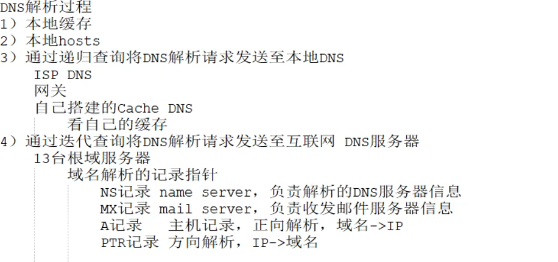
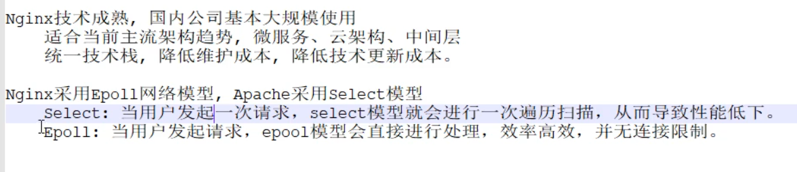
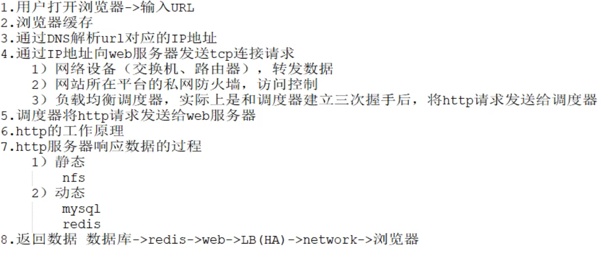
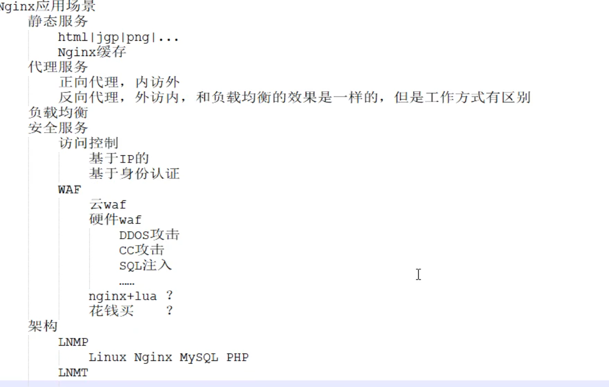
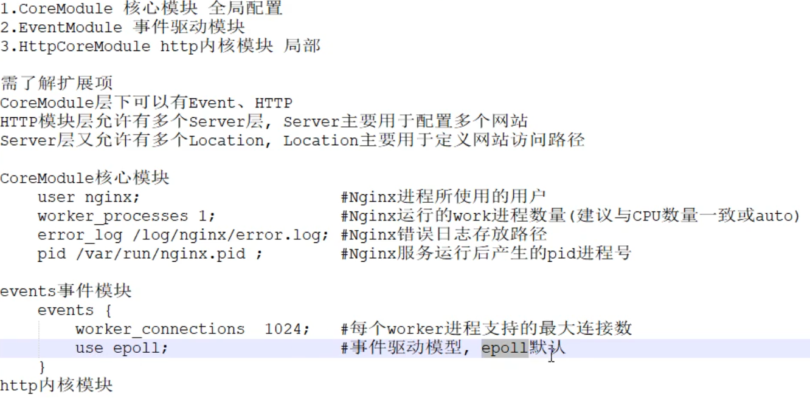
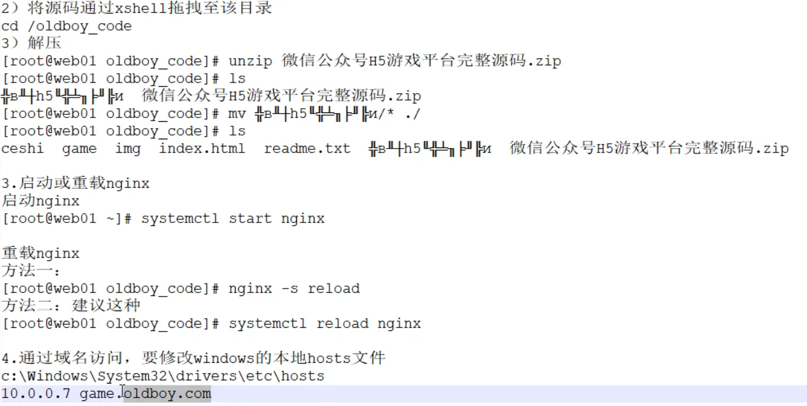
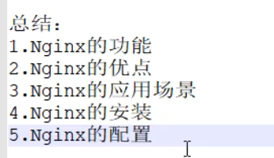

# nginx (Http回顾)

## 1.nginx 的功能

web服务器, 负载均衡, 反向代理, 安全控制



## 2.nginx 的优点

轻量, 高可靠, 高性能, 开源, 模块化(功能 , 代码) ,配置可读性高, 二次开发容易实现



## 3.nginx 的应用场景

web应用, 负载均衡, 代理, 缓存, 安全访问





## 4.nginx 的安装

安装方式

- EPEL源 : 版本低,功能少
- 官方源 : 官方编译好,封装成rpm包, 并提供yum源, 推荐使用

- 预编译 : 自己下载配置, 然后configure/make/make install

### 4.1. 预编译安装

vim /etc/yum.repos.d/nginx.repo

```repo
[nginx]

name=nginx repo

baseurl=http://nginx.org/packages/centos/7/$basearch/

gbgcheck=0

enable=1
```

或者

rpm -ivh http://nginx.org/packages/centos/7/noarch/RPMS/nginx-release-centos-7-0.el7.ngx.noarch.rpm

## 5.nginx 的配置

总配置文件 : /etc/nginx/nginx.conf

核心配置文件

​	事件配置文件

​		HTTP配置文件

​			server

​				location

站点(server)的配置文件: /etc/nginx/conf.d/*.conf

### 服务器管理

​	nignx.service

​	systemctl 指令 nginx.service

### 命令工具

nginx 

​	-v 盘本

​	-V 查看配置





6.总结





